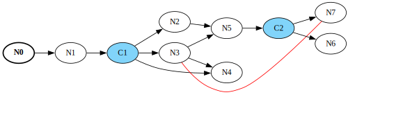
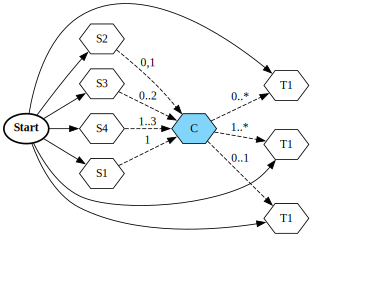
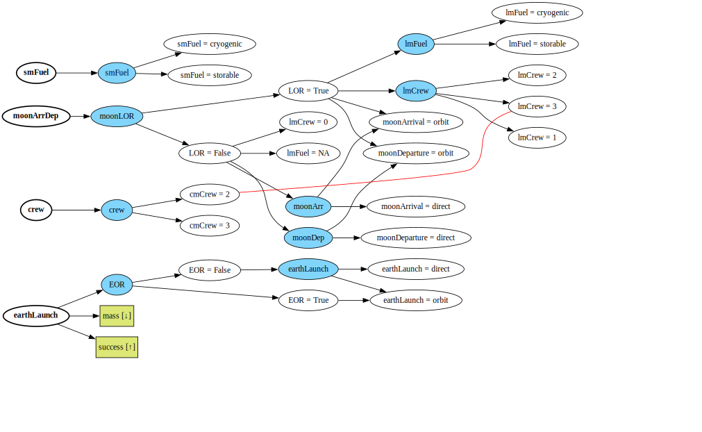
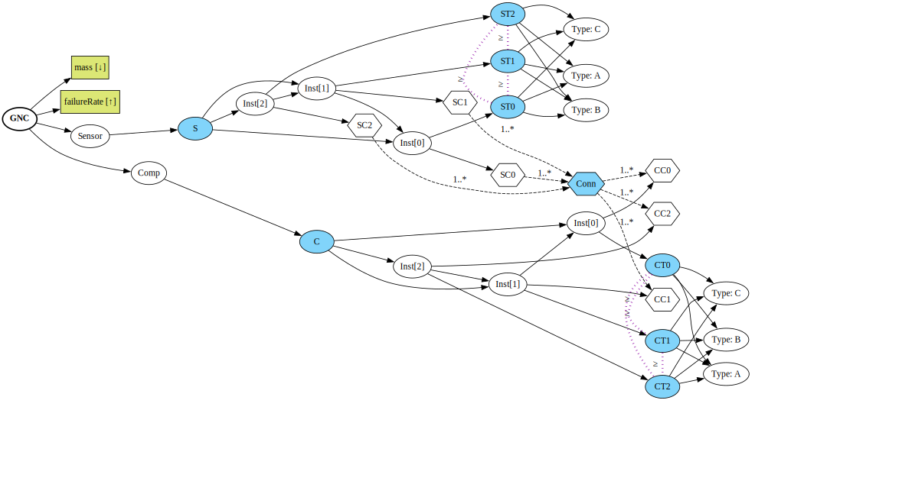

# The Design Space Graph (ADSG Core)

The Design Space Graph (DSG) allows you to model design spaces using a directed graph that contains three
types of architectural choices:

- Selection choices (see example below): selecting among mutually-exclusive options, used for *selecting* which nodes
  are part of an architecture instance
- Connection choices: connecting one or more source nodes to one or more target nodes, subject to connection constraints
  and optional node existence (due to selection choices)
- Additional design variables: continuous or discrete, subject to optional existence (due to selection choices)



The library implements:

1. The directed graph, with:
    - Nodes: generic, selection-choice, connector, connection-choice, design variable, metric
    - Edges: derivation, incompatibility, connection, connection-exclusion
    - Choice constraints: linked values, permutations, unordered, unordered non-replacing
    - One or more derivation-start nodes
2. Mechanisms for making choices
    - Influence matrix
    - Graph operations for applying selection- and connection-choices
3. Mechanisms for formulating optimization problems
    - Design variable encoding of selection- and connection-choices
    - Hierarchy analysis and design vector correction
    - Design vector to graph conversion
    - Optimization problem statistics calculation
    - Bridge to the architecture optimization algorithms in [SBArchOpt](https://sbarchopt.readthedocs.io/)

To get started with the DSG have a look at the [guide](guide.ipynb) or [API reference](api_dsg).
For detailed background information refer to the [theory](theory.md).

[Scroll down](#examples) for some quick examples.

*Note: due to historical reasons the package and code refer to the ADSG (Architecture DSG), because originally it had
been developed to model system architecture design spaces. In the context of this library, the ADSG and DSG can be
considered to be equivalent.*

## Citing

If you use the DSG in your work, please cite it:

Bussemaker, J.H., Ciampa, P.D., & Nagel, B. (2020). System architecture design space exploration: An approach to
modeling and optimization. In AIAA Aviation 2020 Forum (p. 3172).
DOI: [10.2514/6.2020-3172](https://doi.org/10.2514/6.2020-3172)

## Installation

First, create a conda environment (skip if you already have one):
```
conda create --name dsg python=3.10
conda activate dsg
```

Then install the package:
```
conda install numpy scipy~=1.9
pip install adsg-core
```

Optionally also install optimization algorithms ([SBArchOpt](https://sbarchopt.readthedocs.io/)):
```
pip install adsg-core[opt]
```

If you want to interact with the DSG from a [Jupyter notebook](https://jupyter.org/):
```
pip install adsg-core[nb]
jupyter notebook
```

## Examples

An example DSG with two selection choices (see the [guide](guide.ipynb)):


An example DSG with a connection choice (see the [guide](guide.ipynb)):



The DSG of the [Apollo problem](example_apollo.ipynb):



The DSG of the [GNC problem](example_gnc.ipynb):


