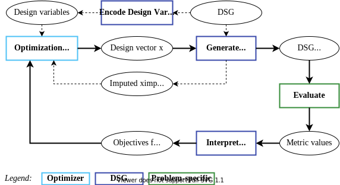

# ADSG Theory

The Architecture Design Space Graph (ADSG) has been developed with the purpose of modeling system architecture
design spaces and formulating architecture optimization problems.
System Architecture Optimization (SAO) is an emerging field in engineering, where a system architecture
(describing a system's functions, components, behavior, and connections[^Crawley2015]) is designed by formulating
the process as a numerical optimization problem[^Bussemaker2020].

Such optimization problems are challenging to solve, as they generally feature design spaces with mixed-discrete
variables, design variable hierarchy, expensive black-box evaluation, and multiple objectives to optimize
for[^Bussemaker2021].
The **mixed-discrete** nature of design variables comes from the fact that an architecture design space typically
combines architectural decisions (e.g. technology selection, component instantiation) with component sizing
parameters.
For example, the design of a turbofan engine architecture might involve deciding whether to include a gearbox and/or
intercooler or not (discrete, categorical variables), the number of compressor/turbine stages (discrete, integer
variable), and the selection of the bypass ratio and pressure ratios (continuous variables).
The **hierarchical** nature of the design space comes from the fact that some architectural decisions might lead
to the inclusion or exclusion of other decisions.
For example, including a gearbox in a turbofan might activate the gear-ratio variable. This also means that if
no gearbox is added, the gear-ratio variable is inactive.

Optimization algorithms that can solve these types of optimization problems are not the scope of the ADSG, however a
bridge to [SBArchOpt](https://sbarchopt.readthedocs.io/) is provided to enable just that.

The ADSG focuses on modeling the architecture design space, focused on representing decision hierarchy.
It has been originally developed to enable function-based system architecture definition[^Bussemaker2020]: the design
space is defined by defining functions (what the system does) and allocating them to components (how the system does
it), optionally defining fulfillment choices to select which component fulfills a specific function in a given
architecture instance.
From this original development, this repository extracts the core mechanism (hence the name) needed for modeling
the design space and formulating an optimization problem from it.
In principle, it is therefore not needed to use the ADSG in the context of function-based system architecting, but some
terminology remains: the ADSG represents an **architecture design space**, and can be used to generate **architecture
instances** (the ADSG with resolved choices).

Following sections provide more details about how choices are modeled, how architecture instances are generated by
taking choices, and how choices are encoded into design variables.

## Choice Modeling

The ADSG has been designed assuming that first tasks related to selecting architecture elements (e.g. decomposing,
mapping, specialization, characterization) are performed, and only as a last step connecting tasks remain. The
connecting task (e.g. deciding which elements from some source set to connect to some target set) depends on the
selection tasks, as that determines which sources/targets are available for connection.
Another assumption is that the choices involved in element selection are tightly coupled and hierarchical, with many
choices only activated based on other choices.
For this purpose, the ADSG is a directed graph that consists of two "domains":

1. Generic nodes, derivation edges, incompatibility edges and selection choices for **selecting** the elements that are
   included in an architecture instance.
2. Connector nodes, connection edges and connection choices for modeling **connection** tasks.

### Selection Choices

A *derivation edge*  is a directed edge that asserts that if the source node is included in an architecture instance,
then the target node is also included in that same instance. A derivation edge can be interpreted as a "requires"
relationship between two nodes.
Generic nodes can have any number of incoming and outgoing derivation edges:

- Multiple outgoing means that *all* target nodes are selected if the node is selected.
- Multiple incoming means the node is selected if *any* of the source nodes are selected.

A *selection choice* node represents an architectural choice where one of the mutually-exclusive option nodes is
selected. A selection choice node can only have one generic node connected by an incoming derivation edge.
When resolved, the singular incoming generic node is connected to the selected option node by a derivation edge.
The nodes not selected and their derived nodes, excluding confirmed nodes (see below), are removed from the graph.

One or more generic nodes are designated as *start* nodes: these nodes and their derived nodes (not passing through
selection choice nodes) are present in all architectures and therefore are designated *permanent* nodes.
Non-permanent nodes are known as *conditional*.
When resolving an ADSG to an architecture instance, nodes derived from a starting node are designated *confirmed* to
highlight the fact that they are part of a specific architecture instance.
Choice nodes are *active* if they are or have been confirmed, *inactive* otherwise.

An *incompatibility edge* is an undirected edge that asserts that if either of the two nodes is confirmed, the other
node and its derived nodes are not.
Incompatibility edges can lead to an infeasible ADSG if both nodes are permanent.

An ADSG containing no more selection or connection choices is designated *final*.
A final and feasible ADSG represents an architecture instance.

The figure below shows an ADSG with 12 nodes (Nx), 2 selection choice nodes (Cx) show in blue, derivation edges
(black arrows), incompatibility edges (red lines). N1 is the starting node (shown in bold).

{ width='75%' }

The table below lists associated node statuses.
It shows N1, N2, N3 and C1 are permanent, because they are derived by the starting node N1.
N0 is never included, because it is not (indirectly) derived by any start node.
All other nodes are conditional, because they depend on being selected by choice C1 and/or C2.
Six feasible architecture instances are listed, obtained by enumerating C1 options and C2 options (if C2 is active).
Selecting a node also selects its derived nodes, for example selecting N5 additionally selects N7, C2, N6 and the cycle
of N8, N9 and N10. Cycles are indeed supported, meaning that if any of the nodes in the cycle is selected, all are.
There are two infeasible architecture instances, in their rows the "✕" indicates the nodes where the associated
incompatibility constraints are violated.

| Node         | N0 | N1 | N2 | N3 | C1  | N4 | N5 | N6 | N7 | C2  | N8 | N9 | N10 | N11 | N12 | N13 |
|--------------|----|----|----|----|-----|----|----|----|----|-----|----|----|-----|-----|-----|-----|
| Permanent    |    | ✓  | ✓  | ✓  | ✓   |    |    |    |    |     |    |    |     |     |     |     |
| Conditional  |    |    |    |    |     | ✓  | ✓  | ✓  | ✓  | ✓   | ✓  | ✓  | ✓   | ✓   | ✓   | ✓   |
| Arch. 1      |    | ✓  | ✓  | ✓  | N4  | ✓  |    |    | ✓  | N8  | ✓  | ✓  | ✓   |     |     |     |
| Arch. 2      |    | ✓  | ✓  | ✓  | N4  | ✓  |    |    | ✓  | N11 |    |    |     | ✓   |     |     |
| Arch. 3      |    | ✓  | ✓  | ✓  | N5  |    | ✓  | ✓  | ✓  | N8  | ✓  | ✓  | ✓   |     |     |     |
| Arch. 4      |    | ✓  | ✓  | ✓  | N5  |    | ✓  | ✓  | ✓  | N11 | ✓  | ✓  | ✓   | ✓   |     |     |
| Arch. 5      |    | ✓  | ✓  | ✓  | N6  |    |    | ✓  |    |     | ✓  | ✓  | ✓   |     |     |     |
| Arch. 6      |    | ✓  | ✓  | ✓  | N13 |    |    |    | ✓  | N11 |    |    |     | ✓   |     | ✓   |
| Infeasible 1 |    | ✓  | ✕  | ✓  | N12 |    |    |    |    |     |    |    |     |     | ✕   |     |
| Infeasible 2 |    | ✓  | ✓  | ✓  | N13 |    |    |    | ✓  | N8  | ✓  | ✕  | ✓   |     |     | ✕   |

### Connection Choices

*Connection choices* offer a generic way to model source to target connection problems, where source and target nodes
are represented using *connection nodes*.
Connection nodes behave the same as generic nodes with respect to derivation edges and selection choice, however
additionally specify a *connector constraint*: a specification of how many outgoing (source) or incoming (target)
connections the connector node can accept, and whether repeated connections to/from the same target/source are allowed.
The connector constraint can be specified as a list of numbers (e.g. 1, 2 or 3 connections: `1,2,3`),
a lower and an upper bound (e.g. between 0 and 3, inclusive: `0..3`), or only a lower bound (e.g. 1 or more: `1..*`).
In the ADSG, a connection choice is defined by adding connection edges from one or more source nodes to a connection
choice node, and from the connection choice node to one or more target nodes.

To model the case where the order of connections is not important, *connection grouping nodes* can be used: the
connector constraint of this node depends on aggregated connector constraints of incoming connection nodes (connected
by derivation edges).
It is also possible to define combinations of source and target nodes that may not be connected using *exclusion edges*.

Using connection (grouping) nodes, connection edges and connection choice nodes, it is possible to represent all
architecture decision patterns identified by Selva et al.[^Selva2016] (the work that inspired the mechanisms behind
connection choices).

The figure below shows an example ADSG with a connection choice (C2).
Its sources are the connection grouping node Grp and connection node S1; its targets are connection nodes T1 and T2.
The connection edges, shown by dashed black arrows, display the connection constraints.
The connection constraint of the connection grouping node Grp is aggregated from constraints by its underlying source
connection nodes S1 and S2: each of these can have either 1 or 2 outgoing connections, which is aggregated to 2, 3 or 4
connections.
The selection choice C1 determines whether S2 is confirmed. If S2 is not confirmed, only S1 remains and the aggregated
connection constraint of Grp is modified to 1 or 2 connections (i.e. derived from S1 only).

{ width='75%' }

The table below enumerates all *valid connections sets* that exist for this example.
It shows that if S2 exists, there are 3 possible sets of valid connection edges.
If S2 does not exist, 5 valid connection sets exist.
The example shows that the valid connection sets can be non-trivial, and that this way of modeling connection
constraints can be very powerful.

<table>
    <thead>
        <tr><th></th><th colspan="4">Connections from / to</th> <th colspan="4">Total connections</th></tr>
        <tr><th></th><th colspan="2" align="center">Grp</th><th colspan="2" align="center">S3</th></tr>
        <tr><th>S2 exists</th> <th>T1</th><th>T2</th><th>T1</th><th>T2</th> <th>Grp</th><th>S3</th><th>T1</th><th>T2</th></tr>
    </thead>
    <tbody>
        <tr><td rowspan="3">Yes</td>
            <td>0</td><td>2</td><td>1</td><td>0</td> <td>2</td><td>1</td><td>1</td><td>2</td></tr>
        <tr><td>1</td><td>1</td><td>0</td><td>1</td> <td>2</td><td>1</td><td>1</td><td>2</td></tr>
        <tr><td>1</td><td>2</td><td>0</td><td>0</td> <td>3</td><td>0</td><td>1</td><td>2</td></tr>
        <tr><td rowspan="5">No</td>
            <td>0</td><td>1</td><td>1</td><td>1</td> <td>1</td><td>2</td><td>1</td><td>2</td></tr>
        <tr><td>1</td><td>0</td><td>0</td><td>0</td> <td>1</td><td>0</td><td>1</td><td>0</td></tr>
        <tr><td>1</td><td>0</td><td>0</td><td>2</td> <td>1</td><td>2</td><td>1</td><td>2</td></tr>
        <tr><td>0</td><td>2</td><td>1</td><td>0</td> <td>2</td><td>1</td><td>1</td><td>2</td></tr>
        <tr><td>1</td><td>1</td><td>0</td><td>1</td> <td>2</td><td>1</td><td>1</td><td>2</td></tr>
    </tbody>
</table>

A connection choice is resolved by applying the edges of a valid connection set directly from source to target nodes
and removing the connection choice node.
Connection choices are resolved independently of other connection choices, however they depend on selection choices:
connection choices are therefore resolved after all selection choices have been resolved, making it possible that some
or all of the source and/or target nodes have been removed because they are not selected.
Effectively, this means that a different connection choice is defined for each source and target node
*existence scenario*.
If for a given existence scenario it is not possible to establish valid connection sets adhering to all connector
constraints, the associated ADSG is infeasible.

### Design Problem Definition

Next to selection and connection choices, it is also possible to define generic design variables, for example to model
parameter selections.
These are defined using *design variable nodes* that are subject to node selection just as generic nodes and can
therefore exist conditionally.
Continuous design variables are defined by a lower and upper bound (inclusive);
discrete design variables by a list of option values (strings).
Design variable values are assigned after resolving selection and connection choices.

*Choice constraints* allow constraining option availability for choices based on other choices.
For continuous design variables only linking is possible: here the same value relative to the respective design variable
bounds is applied.
For discrete design variables and selection and connection choices, four types of choice constraints are available:
linked, permutations, unordered combinations, and unordered non-replacing combinations.
These constraints are applied by applying the following logic:

- *Linked*: all choices are assigned the same option index, e.g. AA, BB, CC.
- *Permutations*: all choices have a different option index, e.g. AB, AC, BA, BC, CA, CB.
- *Unordered combinations*: choices have an equal or higher index than preceding choices, e.g. AA, AB, AC, BB, BC, CC.
- *Unordered non-replacing combinations*: choices have a higher index than preceding choices, e.g. AB, AC, BC.

Note that permutations and unordered non-replacing combinations constraints require at least the same amount of options
as the amount of choices: it is not possible to define permutations of 2 values for 3 choices for example.
If this condition is not met, the ADSG is infeasible.

The design problem definition is completed by additionally defining performance metrics using *metric nodes*.
Metric nodes represent outputs of an evaluation function and can be used as objectives or constraints in the context of
an optimization problem.
Objectives are minimization or maximization targets and metric nodes can only be used as objectives if they are
permanent, as otherwise it is not possible to compare the performance of all architectures.
Constraints represent inequality design constraints: values that should be above (greater than or equal) or
below (lower than or equal) some threshold.
Metrics used as constraints can be conditional: if the node is not part of some architecture, it means that the
constraint does not apply and the constraint is assumed satisfied (the value is set equal to the threshold).

To summarize, an architectural design space can be modeled with the ADSG using:

- Generic nodes, derivation edges, start nodes and selection choice nodes to define node existence hierarchies.
- Incompatibility constraints to restrict simultaneous existence of nodes.
- Connection (grouping) nodes with connector constraints, connection edges, exclusion edges and connection choice nodes
  to define connection problems (source to target connections).
- Generic design variable nodes to define additional continuous or discrete design variables.
- Choice constraints to restrict possible values within a group of choices or design variables.
- Metric nodes to define output metrics, optionally used as objectives or constraints.

## Design Problem Encoding

Based on the design space definition defined in [the previous section](#choice-modeling), we now present how this
definition is encoded as a set of mixed-discrete design variables `x` to be used by an optimization algorithm, and
how a give design vector **`x`** is decoded into an architecture instance.
We additionally present how design vectors are corrected and imputed to ensure they are valid, that is representing a
feasible and unique architecture instance.

### Selection Choices

Selection choices can be encoded by two encoding algorithms: the fast algorithm and the complete algorithm.
The complete encoder results in more efficient design variable definitions and enables the exhaustive identification of
all valid design vectors. This, however, requires significantly more computational resources (time, memory) than the
fast encoder, which directly maps selection choices to discrete design variables.
When encoding the design space, therefore first the complete encoder is tried. If some time or memory limit is reached,
the fast encoder is used instead.

The *fast encoder* maps selection choices to discrete design variables, with option nodes mapped to integer values
between `0` and `n_opts-1` for each selection choice.
For choice groups constrained by a linked choice constraint (i.e. all choices are assigned the same option index), only
one discrete design variable is defined.
Decoding and correcting design vectors is performed in a greedy manner: starting from the initial ADSG, confirmed
(active) selection choices are assigned options from the given design vector. If for a given selection choice the
requested option node is not available, the requested option node is corrected to the closest available option, thereby
ensuring that the design vector represents a valid architecture.
The process continues until the graph contains no more selection choices.

The *complete encoder* exhaustively identifies all possible discrete design vectors `x_valid_discr` and associated
activeness `δ_valid_discr` and node existence information.
This enables improving optimizer performance by using hierarchical sampling and correction algorithms available in
[SBArchOpt](https://sbarchopt.readthedocs.io/).
Additionally, it enables the calculation of the number of valid architectures, the identification and elimination of
*forced selection choices*, and the identification of all existence scenarios as needed for encoding connection choices.
Decoding and correcting design vectors is done by first ensuring that the requested design vector is valid (i.e. is part
of `x_valid_discr`: if this is not the case, the closest valid design vector as measured by the Manhattan distance is
selected instead.

The table below shows valid design vectors `x_valid_discr` and activeness information `δ_valid_discr` for all feasible
architectures in the [selection choice definition](#selection-choices) example.
Selection choices C1 and C2 are mapped to design variables `x0` and `x1`, respectively.
Even though selection choice C1 has 5 options, the associated design variable `x0` only has 4 options, because N12 can
never be selected as a feasible option.
Selection choice C2 is not present in architecture 5, resulting in an inactive `x1` (`δ1` = False).

| Architecture | `x0` | `x1` | `δ0` | `δ1`  |
|--------------|------|------|------|-------|
| 1            | 0    | 0    | True | True  |
| 2            | 0    | 1    | True | True  |
| 3            | 1    | 0    | True | True  |
| 4            | 1    | 1    | True | True  |
| 5            | 2    | 0    | True | False |
| 6            | 3    | 1    | True | True  |

This is also a good example of the difference between *declared* design space and *valid* design space sizes: the
declared design space is given by the Cartesian product of design variable options, in this example
`n_declared` = 8 (4 x 2), whereas the valid design space is given by the number of feasible architectures,
in this example `n_valid` = 6.

### Connection Choices

A Connection Choice Formulation (CCF) consists of connection (grouping) nodes, connection edges, exclusion edges, and
node existence scenarios for a given connection choice node.
Different CCF patterns are best encoded as design variables using dedicated encoding grammars[^Selva2012].
For example, the assignment pattern is best encoded using a set of binary variables, each of which represents one
combination of source and target nodes, whereas the combination pattern is best encoded by each choice having one
discrete variable with the number of available options.
This is due to two effects discussed by Selva[^Selva2012]: whether there is a one-to-one mapping from
encoded design vectors to the architectures they represent (bijectivity), and whether a small change in a design vector
leads to a small change in represented architecture (non-degradedness).

Bijectivity relates to the difference in declared and valid design spaces: if this difference is large, it is more
difficult to explore the design space for an optimization algorithm, because there is a low chance of generating a valid
design vector when (randomly) searching the design space.
In our work, we quantify this property using the discrete *imputation ratio* `IR`: the ratio between declared and valid
design space sizes.
`IR = 1` indicates a one-to-one mapping between design vectors and architectures (i.e. bijectivity),
whereas values higher than 1 indicate this is not the case. The higher the value, the larger the discrepancy.

Non-degradedness can be quantified by looking at whether a small change in a design vector leads to a small change in
what is represented by that design vector. Having this property improves optimizer performance: optimization algorithms
depend on it for local search and for building surrogate models for global optimization.
In the case of connection choices, a design vector **`x`** represents a connection set, which we can represent as an
`n_src` x `n_tgt` connection matrix `M`, where `n_src` and `n_tgt` represent the number of source and target nodes
involved in a given connection choice, respectively.
We define the *distance correlation* `Dcorr` metric which correlates design vector distance to connection matrix distance using
the Manhattan distance and Pearson correlation coefficient.
`Dcorr = 1` indicates perfect correlation, meaning that a small change in a design vector indeed leads to a similarly
small change in the connection matrix. Lower values indicate less correlation.

The goal is therefore for a given CCF, to select an encoder that minimizes `IR` and maximizes `Dcorr`.
One possibility is to define a dedicated encoder for each architecture decision pattern.
However, a CCF is more flexible than that and therefore the pattern encoders cannot cover all possibilities.
To support all CCFs, the ADSG therefore also contains a library of generic encoders.

The implementation of the CCF, connection matrix `M` enumeration, connection encoders, and the encoder selection
procedure as used by the ADSG is available in the [AssignmentEncoding](https://github.com/jbussemaker/AssignmentEncoding)
repository.

### Generating Architecture Instances

The overall procedure for encoding an ADSG into a set of design variables is as follows:

1. Encode selection choices: try the complete encoder, if not possible (time or memory limits) use the fast encoder.
2. Encode connection choices: for each connection choice, get the CCF and select the best connection choice encoder
   according to `IR` (minimize) and `Dcorr` (maximize).
3. Define additional design variables from design variable nodes.

Decoding a design vector into an architecture instance is done as follows:

1. Decode selection choices: correct and decode design variables associated to selection choices, track activeness
   information, and resolve selection choices.
2. Decode connection choices: for each connection choice, correct and decode using the selected connection choice
   encoder, and resolve connection choices from the decoded connection matrix `M`.
3. Set active additional design variables directly from the design vector.
4. Impute inactive design variables: set inactive discrete variables to 0, inactive continuous variables to mid-bounds.

If the complete selection choice encoder is used, it is possible to generate `x_valid_discr`.
This enables usage of the hierarchical sampling and correction algorithms available in
[SBArchOpt](https://sbarchopt.readthedocs.io/).
Additionally, it allows the problem-level calculation of the number of valid architectures,
and thereby the problem-level `IR`.

### The Optimization Loop

Using the ADSG, the optimization loop (bold arrows) then looks as follows:

1. The ADSG is encoded as design variables.
2. The optimization algorithm drives the loop, and at each iteration suggests a design vector `x` to evaluate.
3. From the ADSG, the design vector is decoded into an ADSG instance.
4. The corrected and imputed design vector, along with activeness information, is communicated back to the optimization
   algorithm.
5. The ADSG instance is evaluated using problem-specific code to obtain metrics for each selected metric node.
6. Metrics are interpreted as objectives or constraints, and communicated back to the optimization algorithm.

[^Crawley2015]: Crawley, E., Cameron, B., & Selva, D. (2015). System architecture: strategy and product development for complex systems. Prentice Hall Press. ISBN: 0133975347

[^Bussemaker2020]: Bussemaker, J.H., Ciampa, P.D. and Nagel, B., 2020. System architecture design space exploration: An approach to modeling and optimization. In AIAA Aviation 2020 Forum (p. 3172). DOI: [10.2514/6.2020-3172](https://doi.org/10.2514/6.2020-3172)

[^Bussemaker2021]: Bussemaker, J.H., Bartoli, N., Lefebvre, T., Ciampa, P.D. and Nagel, B., 2021. Effectiveness of surrogate-based optimization algorithms for system architecture optimization. In AIAA Aviation 2021 Forum (p. 3095). DOI: [10.2514/6.2021-3095](https://doi.org/10.2514/6.2021-3095)

[^Selva2016]: Selva, D., Cameron, B., & Crawley, E. (2016). Patterns in system architecture decisions. Systems Engineering, 19(6), 477-497. DOI: [10.1002/sys.21370](https://doi.org/10.1002/sys.21370)

[^Selva2012]: Selva, D. (2012). Rule-based system architecting of Earth observation satellite systems (Doctoral dissertation, Massachusetts Institute of Technology).
